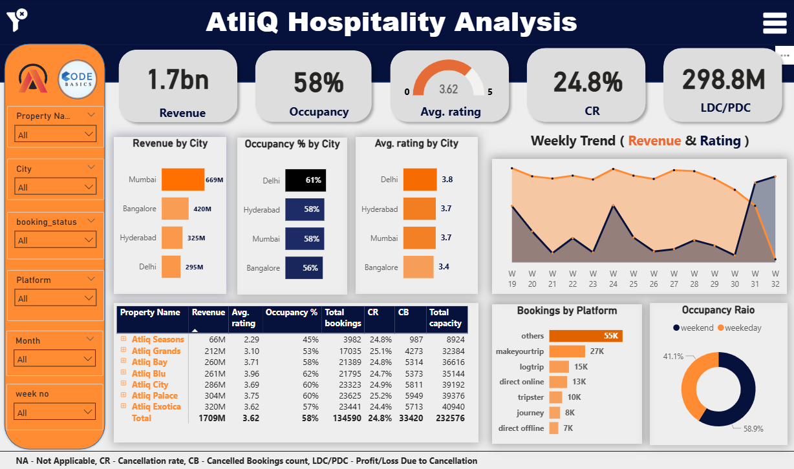
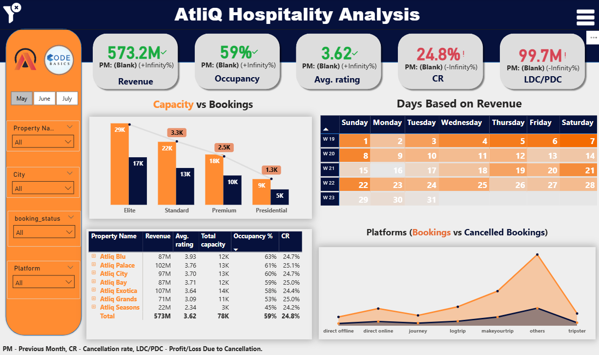

# 🧾 Revenue insights in hospitality domain - Hospitality

---
<h2>Summary</h2>

- Developed an interactive Power BI dashboard for AtliQ Hospitality to analyze market share and revenue decline over 3 months, enabling stakeholders to identify key factors of a 15% loss.
- Worked with Revenue and Sales teams to define 10+ KPIs, implemented 10+ custom metrics using DAX, and transformed raw datasets of 100K+ rows using Power Query, resulting in a 25% improvement in reporting accuracy and a 30% reduction in manual reporting time.
- Presented insights that informed strategic decisions, contributing to a potential 20% recovery in revenue and improved dashboard adoption across departments.

---
<h2>Dashboard Images</h2>

- Power BI Dashboard shows:
  - Overall Analysis
  - Monthly Analysis

---
<h2>Author & Contact</h2>

**Nikhil S Kumar**  
Business Analyst
📧 Email: n8nikhil@gmail.com
🔗 [LinkedIn](https://www.linkedin.com/in/nikhil-kumar-0a1720129/)
